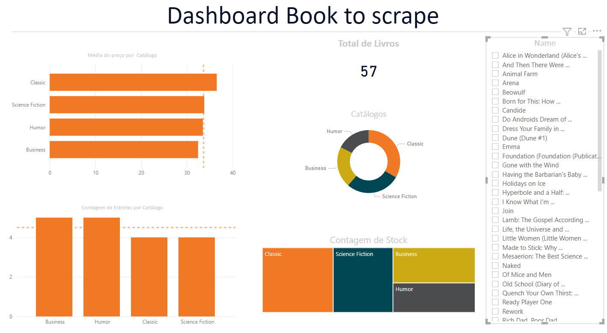

# **Books_to _Scrape**

 ## Web scraping, mining to extract data from the site, Book to Scrape, and converting them into structured information for further analysis.

***

# 1. Business Problem.

# 2. Business Assumptions.

# 3. Solution Strategy

# _**O método SAPE**_

**Step 01. Data Description:**

**Step 02. Feature Engineering:** 

**Step 03. Data Filtering:** 

**Step 04. Exploratory Data Analysis:**

**Step 05. Data Preparation:**

**Step 06. Feature Selection:**

**Step 08. Hyperparameter Fine Tunning:**

**Step 09. Convert Model Performance to Business Values:**

**Step 10. Deploy Modelo to Production:** 

# 4. Top 3 Data Insights

**Hypothesis 01:**

**False.** 

**Hypothesis 02:**

**False.** 

**Hypothesis 03:**

**False.** 

# 5. Business Results

# 6. Conclusions

# 7. Lessons Learned

# 8. Next Steps to Improve

**1.** **Develop an app**

**2.** **Run a Design Discovery**

1.	**Problema de Negócio**
- Qual catálogo possui o melhor preço de compra segundo as recomendações dos clientes?
   - Qual catálogo possui o menor preço de compra segundo as recomendações dos clientes?
   - Qual catálogo possui o maior preço de compra segundo as recomendações dos clientes?
***
2.	**Saída: ( Produto final )**
- A resposta para a pergunta: Mediana, Max e Min dos preços dos catálogos.
- Formato da entrega: Tabela e Gráfico
- Local da entrega: PowerBi
***
3.	**Processo ( Passo a Passo )**
- **Passo a passso para construir o cálculo da mediana ou média**
   - [x] Realizar o calculo da mediana sobre o produto, catálogo e avaliação
   - [x] Realizar o calculo da minimo sobre o produto, catálogo e avaliação
   - [x] Realizar o calculo da máximo sobre o produto, catálogo e avaliação 

- **Definir o formato da entrega ( Visualização, Tabela, Texto)**
   - [x] Gráfico com a mediana dos preço dos produtos, por catálogo e avaliação 
   - [x] Tabela com as seguintes colunas: product_name | product_price | product_stock | product_star | product_catalog
   - [x] Definição do schema: Colunas e seu tipo
   - [x] Definição a infraestrutura de armazenamento ( csv )
   - [x] Design do ETL ( Scripts de Extração, Transformação e Carga )
   - [x] Fazer as visualizações
   - [x] Entrega do produto final

- **Decidir o local de entrega ( PowerBi, Telegram, Email, Streamlit, Intranet )**
   - [x] PowerBI
***
4.	**Entrada (Fonte de dados)**

- **Fonte de dados**
   * https://books.toscrape.com/

- **Ferramentas**
   * Python 3.8.0
   * Bobliotecas:Pandas, Numpy
   * Bibliotecas de Webscrapping (BS4)
   * VisualCode
   * Jupyter Notebook ( Analise e prototipagens )
   * PowerBI
 ***

