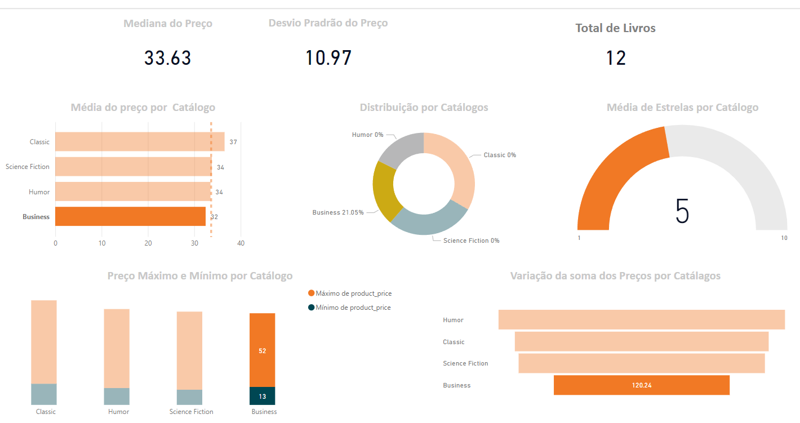
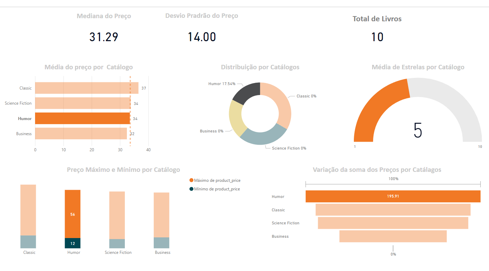
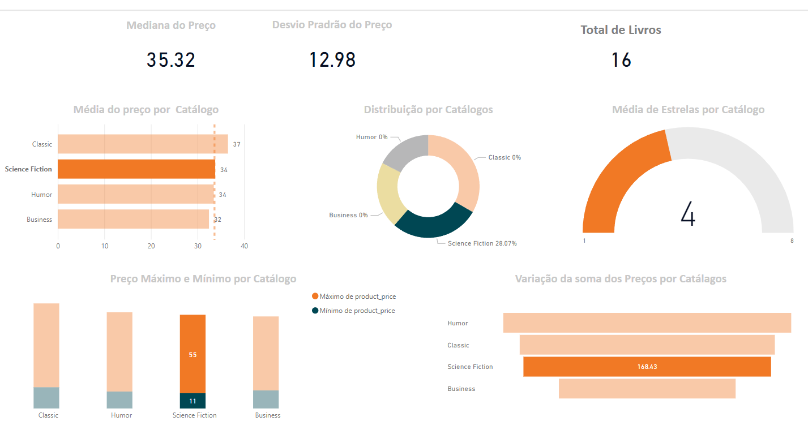

# **Books_to _Scrape**

## Web Scraping with Python

Web scraping or Web data extraction is a way to automatically extract meaningful data available on websites. When there is no direct access to gather data using API or feeds, web scraping can be an effective way to automate data extraction.

In this project, I will use Python to create a simple yet effective web scraping script. This will be my starting point to delve deep into the field of web scraping using Python.

So, let’s begin!

***

## 1. Business Problems

Which catalog should be displayed first in the sales recommendation to users?

### 1.1 Problems

- Extract data from a web page;
- Wrap the python code so we can send a get or post request to the webpage url and get the HTML response;
- Read the HTML content of that page;

### 1.2 objective

* Web data scraping.

* Extraction of structured information for further analysis.

## 2. Business Assumptions.

* Dataset was obtained from [Books to Scrape](books.toscrape.com) 

The variables created during project development are

Variable | Definition
------------ | -------------
|product_name | Book title|
|product_price	 |Sale price|
|product_stock |  Availability|
|product_star | Evaluation|
|product_catalog | Theme to which the book belongs|

## 3. Solution Planning

### 3.0 Define the delivery format (View, Table, Text)
   - [x] Defining the storage infrastructure ( csv )
   - [x] Graph with the median price of products, by catalog and evaluation
### 3.0.0 Decide the delivery location ( PowerBi, Telegram, Email, Streamlit, Intranet )
   - [x] PowerBI

### 3.1 Final product

This project aims to deliver:

- Table with al products
- Deliver the best insights based on data behavior analysis.
- Dashboard in PowerB

### 3.2 Tools

- Python 3.9.0;
   * Libraries:Pandas, Numpy
   * Webscrapping Libraries (BS4)
- Jupyter Notebook ( Analysis and prototyping );
- Git e Github;
- VisualCode
- SQL
   * Libraries:SQLite
- PowerBI (Views)

### 3.3 Solution Strategy

As a data scientist, I believe in the CRISP-DS methodology for project resolution and rapid value delivery. My project followed the following steps based on this methodology:

#### 3.3.1. Business understanding

First of all, I went to understand the business problem. Read about and decide which strategy to use, if the beautiful soup library really was the best way to resolve it. I decided it was and decided to go to the next step

#### 3.3.2. Data Description

This step consists of studying the available data and performing the necessary prior cleaning:

- Study the dimensions of the data
**Step 01:** My goal is to use statistics metrics to identify data outside the scope of business.
   * [x] Perform the median calculation on the product, catalog and evaluation
   * [x] Perform the minimum calculation on the product, catalog and evaluation
   * [x] Perform the maximum calculation on the product, catalog and evaluation
- Convert types, mainly dates and numbers.
- Check the amount of categorical and numerical variables we have.
- Check and treat NA's

#### 3.3.3. Variable filtering

Filter the variables in order to leave only those that make sense to work for our purpose.

#### 3.3.4. Feature Engineering

Creation of hypotheses to validate and generate business insights. In addition to creating variables that impact the sales phenomenon.

#### 3.3.5. Exploratory Data Analysis

Generate some insights to present to the business team.

## 4. Top 3 Data Insights

**Hypothesis 01:** Which catalog has the lowest average selling price with the highest recommendation from users?

- **Reply:** Business

**Hypothesis 02:** Which catalog has the lowest selling price with the highest user recommendation?

**Hypothesis 03:** Which catalog has the highest selling price with the highest user recommendation?

- **Reply:** Humor

**Hypothesis 04:** Which catalog has the highest selling price even though it doesn't have the highest user recommendation?

- **Reply:** Classic

**Hypothesis 05:** Which catalog has the lowest selling price and also the lowest user recommendation?

- **Reply:** Science Fiction

# 5. Business Results
***

# 6. Conclusions

The objective of the project was to extract data from a website and extract structured information in order to answer the business team's question.

Therefore, the preferred catalog in sales recommendations to customers should be **Business**. Because it has the lowest average selling price with the highest rate of customer recommendation. Followed by the **Humor** catalogue, as it has the lowest selling price, although it has the highest rating according to the customer recommendation index.

I believe I have managed to deliver all the demands of the business problems, which can be accessed in the books available in this project can be accessed in the books available in this project.

# 7. Lessons Learned

# 8. Next Steps to Improve

Improvements to be made in a next cycle

 - Perform the collection for all catalogs automatically.
 - Execute new insights and new discoveries.
 - If you have any improvements to suggest, you can contact me through my [LinkedIn](https://www.linkedin.com/in/camiladangelotempesta/)

***
Made By **Camila D'Angelo**

[Portfólio](https://github.com/camila-dangelo-tempesta?tab=repositories)

[LinkeldIn](https://www.linkedin.com/in/camiladangelotempesta/)
